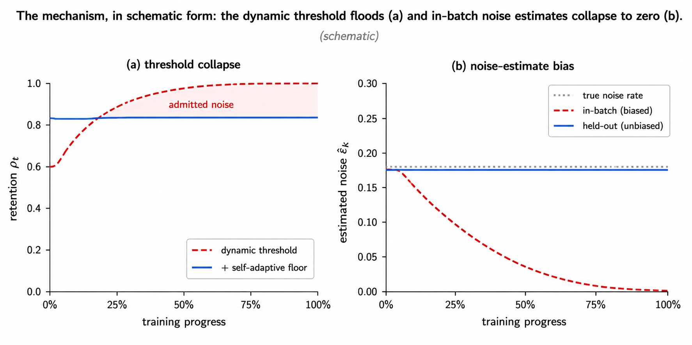
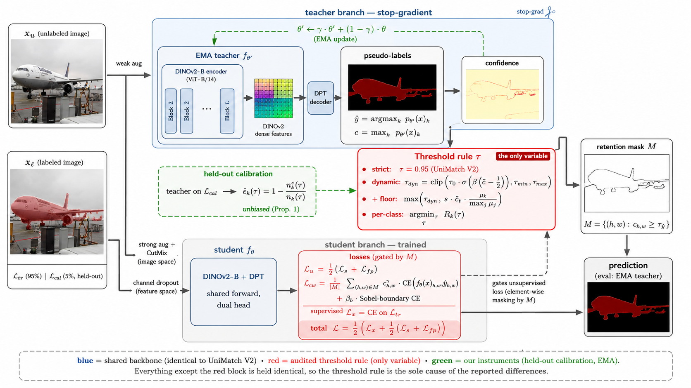
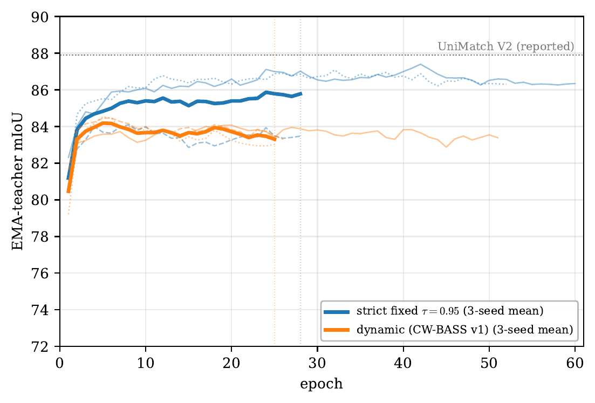

<div align="center">

# CW-BASS v2

### Saturation-Aware Pseudo-Label Selection for Semi-Supervised Segmentation under Foundation-Model Teachers

[](https://psychofict.github.io/CW-BASS-v2/)
[](https://huggingface.co/psychofict/cwbass-v2-pascal)
[](https://huggingface.co/spaces/psychofict/cwbass-v2-segmentation)
[](https://arxiv.org/abs/2608.12773)
[](https://paperswithcode.co/api/v1/papers/2608.12773/leaderboard-badge-link?eval=26066)
[](https://paperswithcode.co/api/v1/papers/2608.12773/leaderboard-badge-link?eval=26065)
[](https://paperswithcode.co/api/v1/papers/2608.12773/leaderboard-badge-link?eval=26067)
[](LICENSE)
[](https://www.python.org/)

*Paper: [arXiv:2608.12773](https://arxiv.org/abs/2608.12773). Extends [CW-BASS (IJCNN 2025)](https://arxiv.org/abs/2502.15152) to the foundation-model era.*



</div>

## TL;DR

Semi-supervised semantic segmentation turns on one question: **which pseudo-labels to trust, and how
much.** A generation of selection rules — dynamic thresholds, per-class curricula, soft confidence
weights — answered it for the noisy, under-confident ResNet teachers of the day. Self-supervised
foundation encoders (DINOv2) change the regime: the teacher is now strong and its confidence
**saturates**, so filtering that helped a weak teacher can *hurt* a strong one.

**CW-BASS v2** is a **saturation-aware** selection method that reads the teacher's confidence regime
instead of committing to one rule. It pairs confidence-weighted, boundary-aware self-training with a
**held-out calibration slice** (an unbiased noise estimate) and a **self-adaptive confidence floor**
(with a bounded-retention property), arbitrated by a one-pass **reliability gate**:

> Measure the reliability of the teacher's confident set, **π_kept = Pr[correct | c ≥ τ]**, on the
> held-out slice. Use **strict filtering when π_kept ≥ τ** (the confident set is at least as reliable
> as the confidence it demands), the **adaptive floor** otherwise.

The boundary is the operating threshold itself — **tuned to no mIoU** — yet across **six DINOv2
teachers the gate picks the accuracy-optimal rule blind.** On saturated teachers it selects strict and
reproduces the UniMatch V2 operating point; on the one teacher whose confident set is *unreliable*
(ADE20K, π_kept ≈ 89%) it selects the floor and pulls ahead.

<div align="center"></div>

## See it in action

Before → after (input wiping to the CW-BASS v2 overlay), one per dataset — the rule the gate selects:

<div align="center">


</div>

<div align="center"><b><a href="https://huggingface.co/spaces/psychofict/cwbass-v2-segmentation">▶ Try it on your own images</a></b> — live Gradio Space (ZeroGPU), or run the same app locally from <a href="demo/"><code>demo/</code></a>.</div>

## Method

| Component | Setting |
|---|---|
| Backbone | DINOv2-Base (ViT-B/14), fine-tuned end-to-end |
| Decoder | DPT-lite (4 ViT layers → coarse-to-fine pyramid) |
| Consistency | Image-strong + feature-perturbation streams from one backbone pass (UniMatch V2 style) |
| Self-training | Confidence-weighted cross-entropy + Sobel boundary-aware auxiliary (CW-BASS) |
| Calibration | 5% held-out labeled slice → unbiased per-class pseudo-label noise estimate |
| Floor | Self-adaptive confidence floor with bounded retention (no drift-to-clamp collapse) |
| **Gate** | **π_kept ≥ τ → strict; else adaptive floor** (one forward pass on the held-out slice) |
| Optimizer | AdamW, poly schedule |

## Results

Accuracy tracks the **backbone**, and CW-BASS v2 sits in the top DINOv2 tier. On the saturated Pascal
and Cityscapes teachers its gate selects **strict** filtering (reproducing the UniMatch V2 operating
point, trailing only UniMatch V2's reported numbers); on the confidently-unreliable ADE20K teacher it
selects the **floor** and **exceeds** both our strict baseline (+1.5) and UniMatch V2-B's reported 49.8.

**Pascal VOC** (mIoU, DINOv2-B; headers = labeled images)

| Method | Backbone | 1/16 (92) | 1/8 (183) | 1/4 (366) |
|---|---|:--:|:--:|:--:|
| UniMatch V2 | DINOv2-B | **86.3** | **87.9** | **88.9** |
| **CW-BASS v2** (gate→strict) | DINOv2-B | 84.47 | 87.40 | 88.59 |

1/8 three-seed mean **86.19 ± 1.82** (per-seed 87.40 / 84.09 / 87.08); 1/16 & 1/4 single seed.

**Cityscapes** (mIoU, DINOv2-B)

| Method | Backbone | 1/16 | 1/8 | 1/4 |
|---|---|:--:|:--:|:--:|
| UniMatch V2 | DINOv2-B | **83.6** | **84.3** | **84.5** |
| **CW-BASS v2** (gate→strict) | DINOv2-B | 83.16 | 83.96 | 83.99 |

**ADE20K** (mIoU, DINOv2-B, 1/8 = 2,526 labeled) — *where selection changes the answer*

| Method | 1/8 |
|---|:--:|
| Strict τ=0.95 (our repro) | 49.10 |
| UniMatch V2-B (reported) | 49.8 |
| **CW-BASS v2** (gate→floor) | **50.58** |

### The gate, measured blind

On a held-out slice we measure, per teacher, saturation **S = Pr[c ≥ 0.95]** and reliability
**π_kept = Pr[correct | c ≥ 0.95]** — a forward-only diagnostic that touches no mIoU. All six DINOv2
teachers are saturated, but ADE20K's confident set is *unreliable* (π_kept ≈ 89% vs ≈ 98% on Pascal).
The gate reads exactly this and selects the accuracy-optimal rule on all six blind: strict where the
confident set is reliable, the floor where it is not.

### The decisive control

<div align="center"></div>

EMA-teacher mIoU over training at matched batch (Pascal VOC 1/8, DINOv2-B): strict τ=0.95 vs. the CW-BASS v1
dynamic rule, three-seed means (bold) with per-seed lines. Strict stays clearly above adaptive throughout, and
its best seeds reach the UniMatch V2 operating point (~87.4) — which is why the gate selects strict on this
saturated teacher.

## Released models

Each public checkpoint is the EMA teacher of the rule the gate **selects** on that dataset.

| Dataset | Rule selected | mIoU (1/8) | Weights |
|---|---|:--:|---|
| Pascal VOC | strict | 87.40 | [🤗 cwbass-v2-pascal](https://huggingface.co/psychofict/cwbass-v2-pascal) |
| Cityscapes | strict | 83.96 | [🤗 cwbass-v2-cityscapes](https://huggingface.co/psychofict/cwbass-v2-cityscapes) |
| ADE20K | floor | 50.58 | [🤗 cwbass-v2-ade20k](https://huggingface.co/psychofict/cwbass-v2-ade20k) |

Run them on your own images with the Gradio app in [`demo/`](demo/).

## Installation

```bash
git clone https://github.com/psychofict/CW-BASS-v2.git && cd CW-BASS-v2
pip install -r requirements.txt
```

The DINOv2 backbone is fetched from `facebookresearch/dinov2` via `torch.hub` on first use.

## Training

```bash
# CW-BASS v2 (calibration + floor + gate) — the proposed method
python main.py --config configs/pascal_cwbass_v2.yaml \
  --labeled-id-path dataset/splits/pascal/1_8/split_0/labeled.txt \
  --unlabeled-id-path dataset/splits/pascal/1_8/split_0/unlabeled.txt \
  --save-path exp/cwbass_v2/pascal/1_8/seed0 --seed 0

# Strict τ=0.95 baseline (the rule the gate selects on saturated teachers)
python main.py --config configs/pascal_unimatch_v2.yaml ...
```

Configs for all three datasets are in [`configs/`](configs/); labeled/unlabeled splits in
[`dataset/splits/`](dataset/splits/).

## Inference

```python
import torch
from torchvision import transforms as T
from PIL import Image
from model.semseg.dino_segmentor import DINOv2Segmentor
from core.inference import whole_inference

model = DINOv2Segmentor(backbone='dinov2_vitb14', nclass=21, pretrained=False).eval()
model.load_state_dict(torch.load('cwbassv2_pascal_dinov2b_1over8.pth', map_location='cpu'),
                      strict=False)   # training-only proj_head is inference-unused
norm = T.Compose([T.ToTensor(), T.Normalize((0.485, 0.456, 0.406), (0.229, 0.224, 0.225))])
img = norm(Image.open('example.jpg').convert('RGB')).unsqueeze(0)
with torch.no_grad():
    pred = whole_inference(model, img).argmax(1)   # [1, H, W] class indices
```

The live demo runs at [🤗 psychofict/cwbass-v2-segmentation](https://huggingface.co/spaces/psychofict/cwbass-v2-segmentation). The [`demo/`](demo/) folder is the
same Gradio app, pulling the released weights from the Hub:

```bash
pip install -r demo/requirements.txt gradio
python demo/app.py
```

## Tests

```bash
python -m pytest tests/ -q     # CPU-only; threshold/floor, calibration, boundary loss, dual-stream, train step
```

## Citation

```bibtex
@article{tarubinga2026cwbassv2,
  title   = {CW-BASS v2: Saturation-Aware Pseudo-Label Selection for
             Semi-Supervised Segmentation under Foundation-Model Teachers},
  author  = {Tarubinga, Ebenezer},
  year    = {2026},
  journal = {arXiv preprint arXiv:2608.12773},
  eprint  = {2608.12773},
  archivePrefix = {arXiv},
  primaryClass  = {cs.CV}
}
```

The v1 method: **CW-BASS**, *Confidence-Weighted Boundary-Aware Learning for Semi-Supervised Semantic
Segmentation*, IJCNN 2025 ([arXiv:2502.15152](https://arxiv.org/abs/2502.15152)).

## Acknowledgements

Built on [UniMatch V2](https://github.com/LiheYoung/UniMatch-V2) and
[DINOv2](https://github.com/facebookresearch/dinov2). Code released under Apache-2.0; the data
pipeline and the ResNet-era backbones derive from UniMatch V2 / ST++ (MIT). Upstream notices are
reproduced in [NOTICE](NOTICE).
